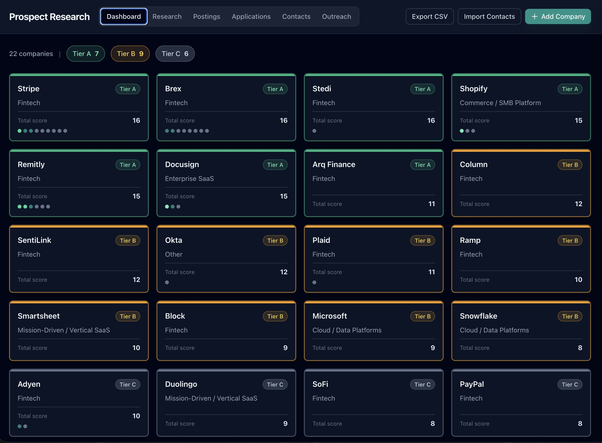
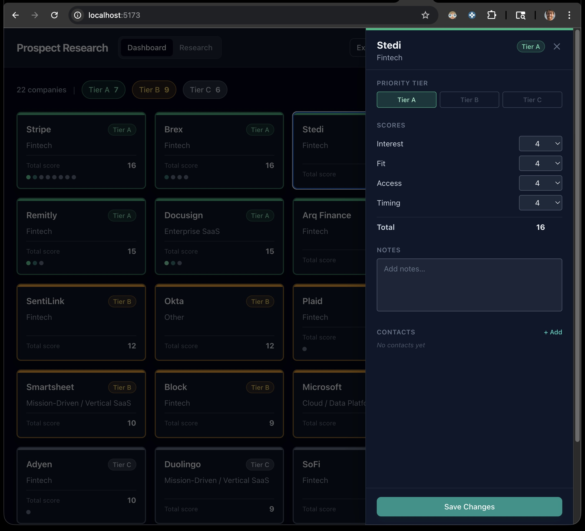
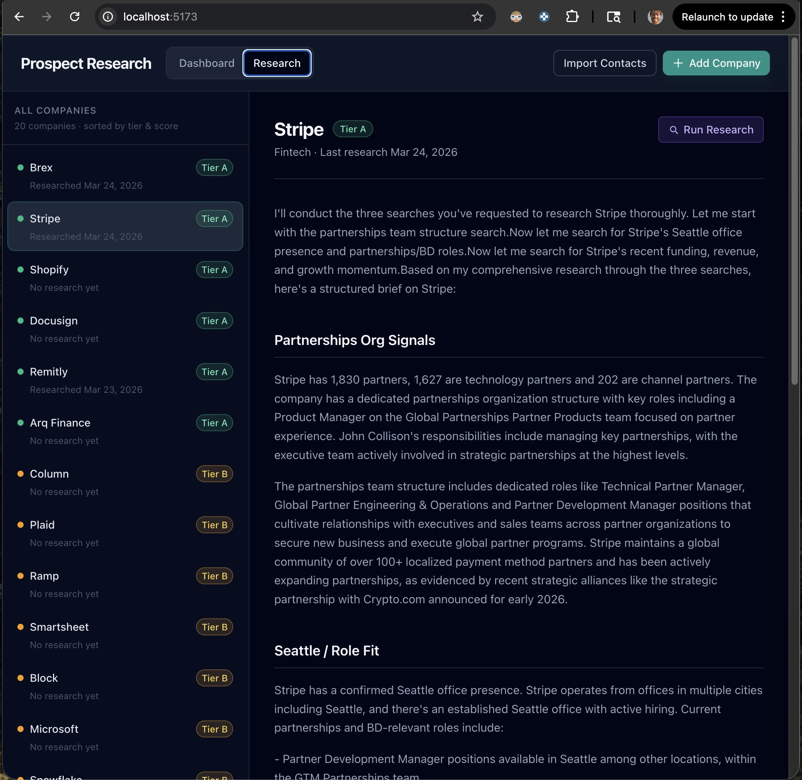

# Prospect Research Tool

A personal job search CRM built to track target companies, score them across multiple dimensions, manage contacts, log outreach, and generate AI research briefs on demand.

Built entirely with Claude Code (Anthropic's AI coding CLI) over the course of a few weeks while actively job searching.

---

## What it does

- **Dashboard** — grid of target companies, color-coded by priority tier (A/B/C), showing composite scores and contact warmth indicators
- **Detail panel** — edit priority tier, individual scores (Interest, Fit, Access, Timing), notes, contacts, and outreach history per company
- **Research workspace** — runs a live AI research brief for any company using Claude's `web_search` tool, streamed in real-time; results are saved to the database
- **Postings tab** — daily job posting monitor that fetches open roles from Greenhouse ATS across tracked companies, detects new postings since the last run, and provides a filterable, multi-sortable table view (see below)
- **Export** — downloads all companies and scores as a CSV
- **Contact import** — bulk-import contacts from CSV or JSON

---

## Screenshots

**Dashboard view** — 22 companies sorted by tier and score, with tier counts in the header



**Detail panel** — editing priority tier, scores, and contacts for a company



**Research workspace** — AI-generated brief for Stripe, streamed from the Claude API using live web search



---

## Postings tab

The Postings tab turns the tool from a static snapshot into a passive job signal monitor. It polls the public [Greenhouse job board API](https://boards-api.greenhouse.io/v1/boards/{slug}/jobs) for each tracked company that uses Greenhouse as their ATS.

### How it works

1. **Scheduled fetch** — a `node-cron` job runs on a configurable schedule (frequency and time set directly in the UI). On each run it fetches all open roles for every Greenhouse-enabled company and upserts them into a `job_postings` SQLite table.
2. **New posting detection** — jobs that appear for the first time since the last run are flagged `is_new = 1`. Jobs that disappear from the live feed are marked `status = 'closed'`. Running the fetch a second time clears the new flags so only genuinely new postings since the *last* run are highlighted.
3. **Manual trigger** — a "Run Now" button in the sidebar fires the same fetch immediately, useful for on-demand checks outside the scheduled window.

### Filtering

Filters are applied client-side and persist across sessions via `localStorage`.

- **Grouped title filter (query builder)** — build multi-condition title filters with explicit AND/OR logic:
  - Each *group* has a **Match ANY / ALL** toggle that controls whether rules inside it combine with OR or AND
  - Multiple groups connect via a clickable **AND / OR** pill between them
  - Each rule has a cycling mode badge: **contains** (teal) → **starts with** (violet) → **excludes** (rose)
  - Comma-separated values within a rule are treated as OR terms (e.g. `partner, bd, alliance`)
  - Example: *(contains "partner, bd") AND (excludes "law firm, counsel")*
- **Location** — substring match (e.g. `Seattle`, `Remote`)
- **Department** — substring match against Greenhouse department tags
- **New only** — show only roles flagged as new since the last fetch run
- **Show closed** — reveal roles that have since been removed from Greenhouse (hidden by default)
- **Company checkboxes** — include or exclude individual companies from results

### Sorting

Click any column header to sort; **Shift+click** to add a secondary (or tertiary) sort key. Active sort columns show a direction arrow and a rank indicator (①②). Clicking an active header cycles: ascending → descending → removed. Default sort is First Seen descending.

Sortable columns: Company, Title, Location, Department, First Seen.

### Schedule configuration

The fetch schedule is configured in the sidebar of the Postings tab itself — no `.env` editing required. Choose a frequency (every day or weekdays only) and a time (hour + minute). The server reschedules the `node-cron` job immediately on save and shows the next projected run time.

---

## Tech stack

| Layer | Stack |
|---|---|
| Frontend | React 18, Vite, Tailwind CSS |
| Backend | Node.js, Express |
| Database | SQLite via `better-sqlite3` |
| AI | Anthropic Claude API (`claude-sonnet-4-20250514`) with `web_search` tool |
| Scheduling | `node-cron` (server-side, dynamically reconfigurable from the UI) |
| Dev tooling | Claude Code (AI coding CLI) |

---

## How AI was used

**Claude Code** was used as the primary development tool throughout — not for boilerplate generation, but for iterative feature work: designing the data model, building out the API, wiring up the React components, and debugging. The feature additions (outreach logging, contact import, research streaming, tier editing, CSV export) were each built in conversation with Claude Code, reviewing the actual code before and after each change.

The **in-app research feature** uses the Anthropic API directly: when "Run Research" is clicked, the server sends a structured prompt to Claude with the `web_search` tool enabled, performs three targeted searches about the company (partnerships org, Seattle presence, recent momentum), and streams the synthesized brief back to the client via Server-Sent Events.

The goal was to learn what it actually feels like to build something real with an AI coding assistant — including where it's fast, where it needs correction, and how to stay in control of the output.

---

## Setup

```bash
# Install dependencies
npm run install:all

# Add your Anthropic API key
echo "ANTHROPIC_API_KEY=your_key_here" > .env

# Run migrations (first time only)
node server/db/migrate.js

# Start dev servers
npm run dev
```

Runs on `localhost:5173` (client) proxying to `localhost:3001` (API).
